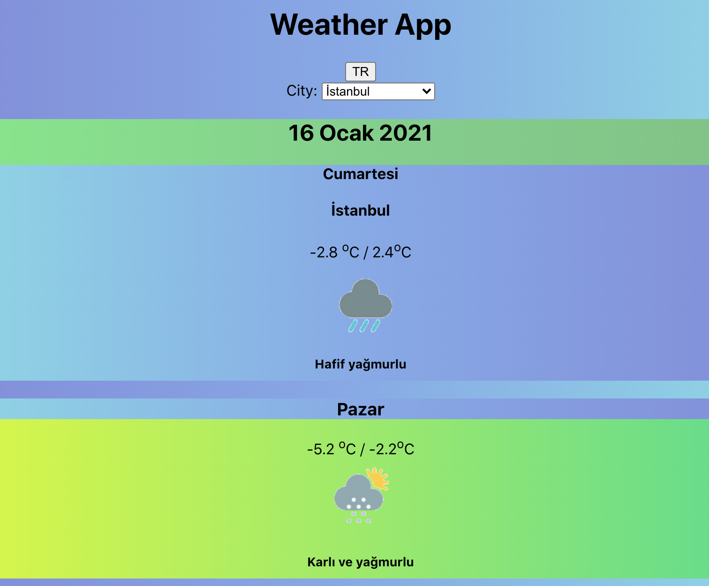

# Weather App with React

[Click to Visit Live Preview Page](https://fyilmazf-weather-app.netlify.app/)  

# Screenshot:  


**In app used:**  
[Weatherbit.io API](https://www.weatherbit.io/) 

**!! Before to use, you have to set this variable to your API key in .env file:**  
REACT_APP_API_KEY

# Start
```yarn start```

# Build

```yarn build```
